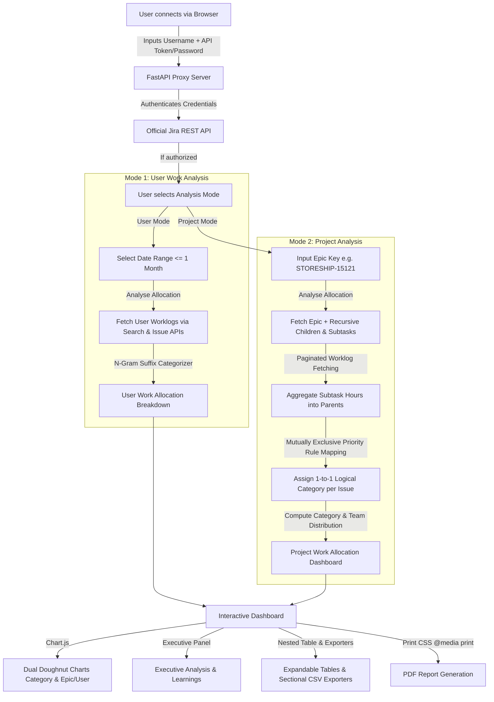

# Work Analyzer

A lightweight, secure, and highly reliable self-contained web application designed to analyze and aggregate your Jira worklog metrics. **Work Analyzer** is completely independent of Generative AI or third-party AI APIs, delivering deterministic, repeatable, and 100% consistent work allocation insights.

---

## High-Level Architecture & Workflow



---

## Feature Overview & Key Capabilities

### 1. Dual Analysis Modes
- **User Work Analysis:** Analyzes an individual user's worklogs for a specified date range (up to 1 month). Highlights time spent by Epic and Activity Category.
- **Project Analysis (Epic-Level Effort Analysis):** Analyzes total effort across an entire project or Epic hierarchy (`Epic Key`), recursively aggregating all worklogs logged across the entire lifecycle of the Epic, its direct child issues, and linked subtasks.

### 2. Recursive Aggregation & Deduplication
- **Subtask Worklog Rollup:** Subtask worklogs automatically roll up into their respective main parent task without double-counting.
- **Strict 1-to-1 Issue Categorization:** Each issue is mapped to **exactly one** mutually exclusive logical category:
  1. `Technical Spike / Setup (Keycloak & Repos)`
  2. `Architecture Reviews & Analysis`
  3. `Refinement & Planning`
  4. `Collaborations & Reviews`
  5. `GenAI Tooling`
  6. `Pure Implementation / Coding` *(Default Fallback)*

### 3. Executive "Analysis & Learnings" Panel
- Deterministically generates actionable high-level insights on major effort drivers and process efficiency recommendations without relying on LLM/AI calls.

### 4. Interactive Dashboard & Visualizations
- **Dual Chart.js Visualizations:** Interactive doughnut charts showing Category-wise and Team/User-wise Effort Distributions.
- **Epic & Custom Metadata:** Displays Epic summary, status, priority, due date, created/updated dates, labels, Cost Unit Number, and Brodos Global Project Number.
- **Nested Category → Issue Table:** Clickable expandable category parent rows revealing associated Jira issues and percentage contributions.

### 5. CSV & Print PDF Exporting
- **Sectional CSV Downloads:** Export buttons for Epic/User Distribution, Category Distribution, Issue Breakdown, and Raw Detailed Worklogs.
- **Print & PDF Optimization (`@media print`):** Embedded media queries automatically expand tables, show metadata/learnings, and hide navigation/controls when printing or saving to PDF.

---

## Technical Stack

- **Backend:** Python 3.11+, FastAPI, Pydantic v2, Requests.
- **Frontend:** HTML5, Vanilla JS (Modular & In-Memory Credential Handling), Tailwind CSS, FontAwesome 6, Chart.js.
- **Testing:** Python `unittest` & `pytest`.
- **Deployment:** Docker / Podman (Containerized Slim Build).

---

## Installation & Local Execution

### Option A: Direct Local Execution (Python)

1. **Clone/Navigate** to project directory:
   ```bash
   cd work-analyzer
   ```
2. **Install Dependencies:**
   ```bash
   pip install -r requirements.txt
   ```
3. **Run Web Application:**
   ```bash
   python -m uvicorn backend.main:app --port 8000 --host 127.0.0.1
   ```
4. Open `http://127.0.0.1:8000` in your browser.

---

### Option B: Containerized Deployment (Podman / Docker)

The application includes a containerized build compatible with both **Podman** and **Docker**.

1. **Build Container Image:**
   - **Podman:** `podman build -t work-analyzer .`
   - **Docker:** `docker build -t work-analyzer .`

2. **Run Container (Editable/Development Mode with Local Volumes):**
   To make the code fully editable without having to rebuild the image and recreate the container every time, mount your local project directory into the container using a volume. This pairs with Uvicorn's hot-reloader to instantly apply any changes.

   - **Windows Command Prompt (cmd):**
     - **Podman:** `podman run -d -p 8000:8000 --name work-analyzer-app -v "%cd%":/app work-analyzer`
     - **Docker:** `docker run -d -p 8000:8000 --name work-analyzer-app -v "%cd%":/app work-analyzer`

   - **Windows PowerShell:**
     - **Podman:** `podman run -d -p 8000:8000 --name work-analyzer-app -v "${PWD}:/app" work-analyzer`
     - **Docker:** `docker run -d -p 8000:8000 --name work-analyzer-app -v "${PWD}:/app" work-analyzer`

   - **Linux / macOS (Terminal):**
     - **Podman:** `podman run -d -p 8000:8000 --name work-analyzer-app -v "$(pwd)":/app:z work-analyzer`
     - **Docker:** `docker run -d -p 8000:8000 --name work-analyzer-app -v "$(pwd)":/app work-analyzer`

3. **Standard Run Container (Production Mode):**
   - **Podman:** `podman run -d -p 8000:8000 --name work-analyzer-app work-analyzer`
   - **Docker:** `docker run -d -p 8000:8000 --name work-analyzer-app work-analyzer`

3. Access the web app at `http://localhost:8000`.

---

## Running Unit Tests

Execute the full automated test suite covering categorizer rules, subtask rollup aggregation, format_time scaling, deduplication, and edge cases:

```bash
python -m pytest tests/ -v
```

---

## Security & Privacy Assurance

- **Stateless & In-Memory Credentials:** Credentials (Username + Password / API Token) are stored exclusively in browser JavaScript session memory. Credentials are **never** persisted to disk, environment files, databases, or external servers.
- **100% Deterministic & Local:** No external GenAI API calls or AI server dependencies are used. All metrics and calculations are audit-ready and deterministic.
